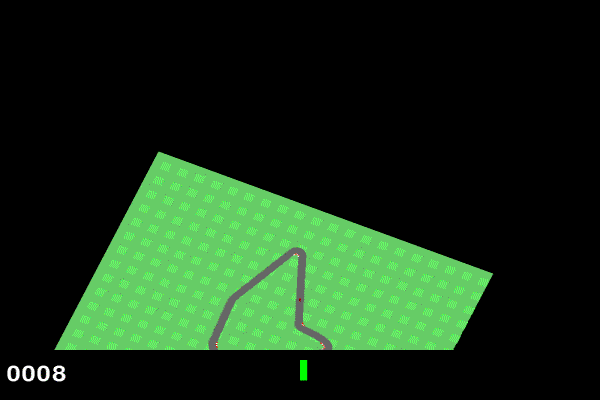

# ADP1. 自动驾驶模仿学习练习

> - 本文是模仿学习以及 Dagger 的一个练手项目，因此使用的模拟器为轻量级的 Gym CarRacing-v0 环境。
> - 理论知识请看文章：[AD2. 模仿学习(Imitation Learning)](https://zhuanlan.zhihu.com/p/521799809)
> - 本文的代码仓库位于 [Github](https://github.com/Alexbeast-CN/dagger)
> - 代码的构建借鉴了纽约大学博士生 Karthik Garimella 的代码仓库 [dagger](https://github.com/kvgarimella/dagger)

## 1. 实验环境简介

Car Racing 是一个只提供俯视图的简易赛车环境，玩家使用箭头方向键来控制小车，当小车不断向前且保持在车道中心线便会获得奖励。

- 动作空间：油门(float32)，刹车(float32)，方向盘(float32，左转减，右转加)。
- 图片尺寸：96*96*3

> 更多介绍请查看 OpenAI Gym 的 [官方文档](https://www.gymlibrary.ml/environments/box2d/car_racing/)

## 2. 系统的整体框架

## 3. 神经网络的构建

## 4. Dagger