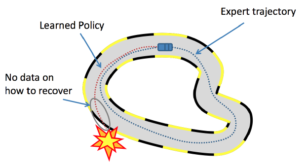

# ADP 2. 自动驾驶数据集

## 1. 模仿学习数据集简介

本教程使用主要方法是模仿学习 (Imitation Learning)。模仿学习与深度学习方法类似，通过喂带有标签的数据来训练神经网络预测没有见过数据标签。之所以叫模仿学习，是因为这里的标签不仅仅是字符串，而是能够控制一个机器人与环境进行交互的动作。模型的输入也是由机器人的传感器在环境中所获取的图像或者其他数据。

在自动驾驶中，数据通常有两种，一种是 on policy 的，另外一种是 off policy 的。大多数情况我们从网上下载的数据，都是 off policy 的数据集，即别人收集并录制好的，这样的数据集存在很大的偏移性问题。由于 IL 本身的问题，所训练的 Agent 无法与数据集完全相同，并且在 agent 与环境交互的时候，如果遇到没有见过的场景，agent 的表现就会变得很差。比如，在下图所示的场景中，agent 在一个弯道处出现了与训练集数据中不同的动作导致轨迹发生了偏移。因此传感器所获取的场景数据也出现了偏移，即出现了新的场景。由于此场景没有被训练过，因此 agent 只能随便猜一个动作，从而导致了撞车。



为了避免这样的问题，我们需要使用 DAgger 外加 on policy 的数据集来训练 agent，关于 DAgger 的解释请看 [AD2. 模仿学习(Imitation Learning)](https://zhuanlan.zhihu.com/p/521799809)。on policy 的数据通常有两种获取形式，一种是让人类专家在 IL agent 训练的过程中对其给予指导（目前英国自动驾驶企业 Wayve）就是这样做的。另外一种方式是用一个自动化的程序在 IL agent 的训练过程中给予指导。让人来指导作为研究者来说没有足够的资料来支持我们做到这点，因此接下来我将解释如何创建一个自动化的 expert。

## 2. Roach

目前来说，自动化的 expert 共有两种，一种是通过基于交通规则的手动编程 expert。这样中自动驾驶 expert 可以获取到环境真值，如前车到自己的距离，从而进行车辆的控制。另外一种是基于强化学习的 expert，如 [Roach](https://arxiv.org/abs/2108.08265)[Z. Zhang et al., ICCV 21]。自 DeepMind 的 AlphaGo 之后，人们普遍认同强化学习的 expert 具有超越人类水平的潜力。因此这里我们主要介绍 Roach。

> Roach 的代码仓库位于 [Github](https://github.com/zhejz/carla-roach)。

### 2.1 简介

Roach 是一个使用 PPO 算法在 Carla 模拟器中进行训练的一个强化学习 agent，模型框架如下图所示。该模型可以直接获取模拟器中的场景的语义分割真值，并使用鸟瞰图的方式展示出来。通过 ResNet34 对鸟瞰图进行特征提取后，将场景特征与其他一些辅助值一同送到 PPO 中，随后得到该场景下的运动，如，['steer':0.5, 'throttle': 0.3, 'brake': 0.0]. 通过 carla leaderboard 的测试，Roach 在驾驶表现分上的确超越了其他手动编写的 autopolit，此后， 22 年 6 月发表的使用 Roach 的 TCP 方法，也该方法的优越性。

### 2.2 体验

首先从 github 仓库中下载该程序，并未该程序配置 python 环境

```
git clone git@github.com:zhejz/carla-roach.git
cd carla-roach
conda env create -f environment.yml --name carla
conda activate carla
easy_install ${CARLA_ROOT}/PythonAPI/carla/dist/carla-0.9.11-py3.7-linux-x86_64.egg
```

由于该仓库的模型由 weight and bias 进行结果记录和可视化的，因此，在下载完仓库之后还需注册一个 weight and bias 的账号，然后 Login。

```
wandb login
```

然后就可以正式开始体验了。

如果你想要收集数据，这里推荐使用 Dagger 的方式进行收集。那么，首先对 `./run/data_collect_dagger.sh` 进行以下修改：

- `dataset_root`：要修改为你本地的数据集文件夹。
- `log_video`: true
- 将 `Autopilot` 的部分的代码注释掉，只打开 `Roach` 的代码块。

之后再运行该程序：

```
sh <path to carla-roach>/run/data_collect_dagger.sh
```

运行一段时间后你就可以看到数据收集过程中产生的视频了：


### 2.3 代码分析

这里主要是对强化学习 expert 部分的代码进行分析，文件夹位于 `./agnets/rl_birdview`:


