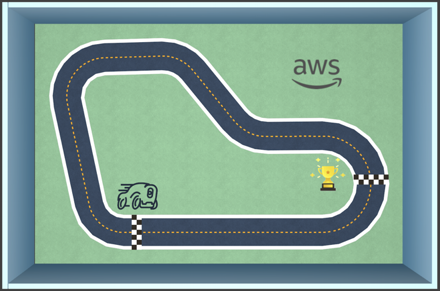

#! https://zhuanlan.zhihu.com/p/517710302
# AD0. 自动驾驶学习资料汇总

## 1. 课程资料

- 德国蒂宾根大学的自动驾驶课程 (Self-Driving Cars, lectureed by Prof. Andreas Geiger, University of Tübingen)
  - [课程视频 | Youtube](https://www.youtube.com/playlist?list=PL05umP7R6ij321zzKXK6XCQXAaaYjQbzr)
  - [课程主页](https://uni-tuebingen.de/fakultaeten/mathematisch-naturwissenschaftliche-fakultaet/fachbereiche/informatik/lehrstuehle/autonomous-vision/lectures/self-driving-cars/)
  - [其他课程资料 | 百度网盘](https://pan.baidu.com/s/1sJshEJ7GC91vAscqzGULoQ)，提取码：xbej

> 本专栏的主要学习资料即来自于蒂宾根大学的自动驾驶课程，本专栏的 [Github](https://github.com/Alexbeast-CN/AD_study)

- 多伦多大学的自动驾驶课程(Launch Your Career in Self-Driving Cars. Be at the forefront of the autonomous driving industry.)
  - [课程视频 | Coursera](https://www.coursera.org/specializations/self-driving-cars)

- 德国波恩大学的自动驾驶课程 (Techniques for Self-Driving Cars" taught at the University of Bonn)
  - [课程视频 | Youtube](https://www.youtube.com/watch?v=EBFlmHqgezM&list=PLgnQpQtFTOGQo2Z_ogbonywTg8jxCI9pD)
  - [课程主页](https://www.ipb.uni-bonn.de/sdc-2020/)

- MIT 的自动驾驶课程 (Self-Driving Cars: State of the Art (2019), taught by Lex Fridman)
  - [课程视频 | youtube](https://www.youtube.com/playlist?list=PLrAXtmErZgOeY0lkVCIVafdGFOTi45amq)
  - [课程主页](https://deeplearning.mit.edu/)
  - [代码仓库 | Github](https://github.com/lexfridman/mit-deep-learning)

## 2. 模拟器

> 由于自动驾驶的模拟器实在是太多了，所以这里暂时就介绍几个我个人觉得比较好用且论文里常见的。当然可能还有一些模拟器也很常见但我没有介绍到，是因为我没有用过。

- [Carla](https://carla.org/) 应该是目前来说用于强化学习单车智能最好的模拟器。
- [TORCS](https://sourceforge.net/projects/torcs/) 一个开源的赛车游戏，因为开源所以被很多人用来做强化学习训练自动驾驶 AI。
- [MetaDrive](https://github.com/metadriverse/metadrive) 港中大开发的一款自动驾驶模拟器，支持多智体的开发。由于港中大的自动驾驶课题组都在用，所以论文找起来很方便。

## 3. 比赛

- [CARLA Autonomous Driving Challenge](https://leaderboard.carla.org/)
  - 基于 Carla 模拟器
  - 比赛规模很大。学界和工业届都会参加
  - 提供 RGB、深度、分割、GPS 和 IMU 传感器
  - 基本上参加比赛的队伍都会发表至少一篇论文
  - 随机找的 [比赛论文](https://www.sciencedirect.com/science/article/pii/S2352146521007699)
  - 随机找的 [代码仓库](https://github.com/bradyz/2020_CARLA_challenge)

- [Learn to race challenge](https://www.aicrowd.com/challenges/learn-to-race-autonomous-racing-virtual-challenge)
  - 基本上每年都有比赛
  - 一般都是 CMU 主办
  - 基于 OpenAI gym 的模拟器
  - 提供 RGB、深度、分割、GPS 和 IMU 传感器
  - 使用强化学习
  - 比赛 [论文](https://learn-to-race.org/assets/papers/2103.11575.pdf)
  - 官方提供的 [代码](https://github.com/learn-to-race/l2r)

- [DeepRacer | AWS](https://student.deepracer.com/home)
  - 基本上每年都有比赛
  - 比赛需要使用 ASW 的服务器进行训练
  - ASW 开发的模拟器
  - 场地内只有一辆带有摄像头的小车
  - 使用强化学习

## 4. 论文

> 读论文是学习自动驾驶的必经之路。

目前自动驾驶的解决方案一般分成两种，一条是工业届目前使用的比较多的 pipeline，即，将自动驾驶任务拆分成多个小块然后一块一块的解决。一般是分成以下五个小块：

另外一条路是直接使用强化学习算法由传感器直接到控制，目前这个方法学界研究的比较多，因为需要开发新的算法，难度很大。

- 下篇：[AD1. 自动驾驶的简介和历史](https://zhuanlan.zhihu.com/p/518099071)
