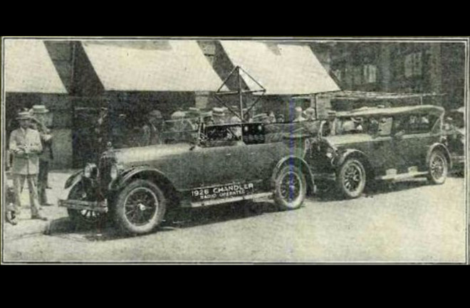

#! https://zhuanlan.zhihu.com/p/518099071
# AD1. 自动驾驶的简介和历史

## 1. 简介

几乎从汽车诞生之日自动驾驶，在一个没有计算机和各种传感器的时代，人们已经开始幻想具有自动驾驶功能的汽车。因为驾驶本身不是一件很难的事情，因为汽车最基本的控制器就只有油门，刹车和方向盘。相对于操作一台复杂的工业机器或者预测股票的价格来说，开汽车是一件相对容易的事情，并且大多数人类经过短期的训练也能够掌握驾驶这项技能。

但很快人们就发现，自己低估了自动驾驶的难度，因为想让计算机完成视觉和识别的任务是非常复杂的。而让计算机学会驾驶技能就是本课程的主要内容。

### 1.1 为什么需要自动驾驶？

这个问题的最简单回答是为了方便，有了自动驾驶之后，便不需要司机在路上一直专心于驾驶。因此所有乘车的人便可以在车内做其他自己想做的事情。当然，除此之外还有更多复杂的原因。

但 2017 年一年，全球就有 130 多万人死于车祸。而大多的车祸原因并不是汽车系统导致的，而是人为因素，如超速，酒驾，疲劳驾驶等。而自动驾驶将会减少此类事件的出现。除此之外，自动驾驶还会有效的避免路怒症等不良交通行为，从而改善交通环境。

此外，根据 Koen Frenken 和 Juliet Schor 的调查，私家车 95% 的时间要么处于堵车要么被放在停车场内，由此造成了极大的浪费。而自动驾驶技术可以让更多的汽车被用于共享经济，如网约车，从而增加汽车的使用时间，减少城市对停车空间的需求。发达共享经济可以减少人们对于私家车的需求，进而缓解城市的交通压力。

### 1.2 自动驾驶的挑战

目前已经有大量的理由和资本来推动自动驾驶行业的发展。然而，不得不说的是目前自动驾驶行业还存在着很多挑战。比如，自动驾驶的安全性。[2018 年的 Uber自动驾驶网约车撞人致死事件](https://internetofbusiness.com/uber-safety-driver-watching-video-before-fatal-crash-say-police/)便给整个行业敲响了警钟。

近些年来，[Tesla 的自动驾驶死亡事件](https://www.vox.com/recode/2020/2/26/21154502/tesla-autopilot-fatal-crashes)也是层出不穷。这不禁让我们反思，也许我们低估了让自动驾驶达到甚至超越人类驾驶水平的挑战难度，上一节的数据告诉我们，人类每年的车祸死亡人数为 130 多万，但当我们将这个事故的数量平均到个人的时候，我们发现大多每一亿英里才会出现一次死亡的案例，这个出错率大约只有 0.000001%，是一个相当不错的成绩。而目前的自动驾驶技术在城市复杂的城市交通环境中想要达到甚至超越这个水平是非常困难的。对于一些依赖视觉的算法来说，天气因素如大雨，大雪，大雾都会严重影响自动驾驶表现。另外在某些国家还存在不规范的道路，如没有车道线，或车道线看不清楚。

另外基于机器学习的计算机视觉需要大量的训练数据，首先收集数据以及标记本身就不容易。除了大数据以外，我们还需要尽可能的收集到除了常规的驾驶条件意外的情况，虽然这些情况并不常见，但往往最容易发生事故。

除了以上的技术问题之外，驾驶行为本身往往存在很多难以决策的道德难题。比如知名的电车问题。而电车问题在驾驶环境中，则可以体现为下图的情况：

> 更多驾驶中的道德难题可以查看 [MIT Moral Machine](https://www.moralmachine.net/hl/zh)

对于自动驾驶来说，因为决策都是由计算机执行的，因此意外发生后，责任需要由汽车的制造商承担，因此这对自动驾驶行业的发展来说也是一个挑战。

## 2. 自动驾驶的历史

似乎自动驾驶是近些年来才出现的概念，但其实早在汽车刚刚诞生不久人们就开始尝试研发自动驾驶技术了。下面我们将走进自动驾驶的历史。

### 2.1 初始时期

在 1886 年的时候， Karl Benz 发明了第一台带有内燃机的汽车，"Benz Patent-Motorwagen Nummer 1"。重 265 kg 每公里耗油 10L，最高速度 16km/h. 这便是汽车的鼻祖，自动驾驶的源头。

> 电影 [Karl and Bertha | Youtube](https://www.youtube.com/watch?v=JyqEz9UkOP8)

在汽车诞生 40 年后，1925年，Houdina Radio Control 公司的 Phantom car 项目被人为是最早的自动驾驶研究，该项目也被称为 "American Wonder"。在该项目中，自动驾驶汽车实际上是被后方的另外一辆汽车中的电脑所控制的。该车辆在被控制的情况下，穿过了交通拥挤的纽约市。但这样的方法和我们想象中的自动驾驶还相差甚远。

> 关于该项目的 [更多介绍](https://www.discovermagazine.com/technology/the-driverless-car-era-began-more-than-90-years-ago)

在之后的 1939 年纽约世界博览会的 Futurama 展馆里，通用之类的汽车巨头便展示了如下的自动驾驶愿景：

1960年的德国也有一些自动驾驶的尝试，RCA's Lab 尝试利用磁场控制汽车在特殊的道路上运行，当时的愿景是 "highway of the future"。在磁场控制方向的情况下，实验中的车辆以 130km/h 的速度跑完了全程。

### 2.2 迈向真正的自动驾驶

在 1980 年代，卡内基梅隆大学(CMU) 的 "Navlab" 项目是第一个基于视觉的自动驾驶车辆。到了 1995 年 Navlab 5 在 98% 为自动驾驶的情况下在美国跑完了 2850 英里的路程。

另外一个项目，同样也是 CMU 在 1988年发表，使用两层神经网络的自动驾驶可以以 70 英里每小时的速度驾驶 90 英里。

> ALVINN 的 [论文链接](https://proceedings.neurips.cc/paper/1988/file/812b4ba287f5ee0bc9d43bbf5bbe87fb-Paper.pdf)

同时期的德国也有类似的项目。1986 年奔驰公司的 VaMoRs 项目，自动驾驶汽车可以完成横向和纵向的控制，并且最高速度达到 36km/h.

### 2.3 第一次技术革新

从 80 年代到目前的自动驾驶已经发生了 3 次技术革新。第一次技术革新是在 2000年左右，通过 GPS 和 IMU 完成的车辆全球定位。GPS 可以将车辆的位置以 1m 的误差定位出来，再结合惯性测量仪(IMU)，车辆的定位误差可以保持到仅有 5cm。从而可以完成点到点的路径导航。

技术的革新往往是由奖金丰富的挑战推动的。在 2004 年的第一届自动驾驶类 Darpa Grand Challenge （仅限美国的队伍参加）中，挑战队伍需要在 Mojave 沙漠中使用自动驾驶汽车完成 249km 的无人干预驾驶。第一名的队伍可以拿到 100万美元的奖金。但可惜的是没有队伍完成挑战，最接近的挑战队伍是 CMU，在距离 11.78km 的时候车辆撞上了一块岩石，并被卡住了。一年之后，即2005 年，依然是 Darpa，依然是 Mojave 沙漠，但有了更多的队伍参加（依然仅限美国），并且奖金翻倍达到了200万美元。这次有 5 个队伍完成了挑战，第一名的队伍来自斯坦福，以 6h54min 的成绩完成挑战，紧随其后的是来自 CMU 的队伍，以 7h05min 的成绩完成。也是在这次挑战之后，自动驾驶技术的可行性得到了确认。

### 2.4 第二次技术革新

第二次技术革新源自与 2006 年左右出现的激光雷达 (Lidar) 的出现。之前的技术往往局限于 2d 的图像传感器，但 lidar 的出现，将深度（距离）引入自动驾驶领域。进而汽车可以获取到高分辨率的三维视图，这令自动驾驶这种对距离敏感的技术带来巨大改变。

于是在 2007 年举办的第三次 Darpa Grand Challenge 中（国际性的比赛），挑战内容更新为了城市挑战，地点位于美国的乔治空军基地，全场96km。参赛者需要不仅需要汽车能够避障，还需要遵守交通，并完成一系列复杂场景的驾驶。最终 CMU 以 4h10min 的成绩获得第一，Stanford 4h29min 第二。

第二次技术革新中也包括自动驾驶的商业化的发展，其中比较有名的是 2009年成立的 Google 自动驾驶团队（后来的 Weymo）。团队中大多数成员都是来自 Darpa 挑战中 CMU 和 Stanford 队伍的成员：Chris Urmson, Dmitri Dolgov, Mike Montemerlo, Anthony Levandowski.

此后，在 2010 年，意大利的 Vislab 在有前车带领的情况下，让一辆基于视觉的无人驾驶汽车一路从意大利开到了中国，上海。全程 16,000 km。

> 详情请看 [论文](https://www.researchgate.net/publication/229593732_The_VisLab_Intercontinental_Autonomous_Challenge_13000_km_3_months_no_driver)

### 2.5 第三次技术革新

第三次技术革新，同样也是 AI 技术的大革新，即深度学习的诞生。自 2012 年起，自动驾驶进入了 AI 时代，即我们现在所使用的自动驾驶技术。关于当前自动驾驶技术的更多内容将在以后的文章中慢慢分享。

- 上篇：[AD0. 自动驾驶学习资料汇总](https://zhuanlan.zhihu.com/p/517710302)
- 下篇: 