#! https://zhuanlan.zhihu.com/p/521799809
# AD2. 模仿学习(Imitation Learning)

> 在阅读本文之前需提前掌握深度学习的基础知识。

reference：
- Self-Driving Lectures, University of Tübingen[Youtube | Imitation Learning: Approaches to Self-Driving](https://www.youtube.com/watch?v=twMHsKYtHKA&list=PL05umP7R6ij321zzKXK6XCQXAaaYjQbzr&index=4)
- UC Berkeley cs182 [Youtube | Learning-Based Control & Imitation](https://www.youtube.com/watch?v=kGc8jOy5_zY), [PPT](https://cs182sp21.github.io/static/slides/lec-14.pdf)
- UC Berkeley cs285 [Youtube | Supervised Learning of Behaviors](https://www.youtube.com/watch?v=H_z7vxGhsQk&list=PL_iWQOsE6TfURIIhCrlt-wj9ByIVpbfGc&index=7), [PPT](https://rail.eecs.berkeley.edu/deeprlcourse/static/slides/lec-2.pdf)
- [arXiv Book | An Algorithmic Perspective on Imitation Learning](https://arxiv.org/abs/1811.06711)
- [arXiv Paper | End-to-end Driving via Conditional Imitation Learning](https://arxiv.org/abs/1710.02410)

> cs285 较 cs182 来说关于 Imitation Learning 部分讲的更全一点。

## 1. 简介

### 1.1 概念

随着机器人和其他智能体所要处理的任务和环境逐渐复杂化，要想手动的对机器人的动作和行为进行编程变得越来越复杂。相对简单的一点的方式是，人类扮演老师的角色来教机器人如何完成任务，而机器人则通过老师的演示，模仿和学习。这便是模仿学习。

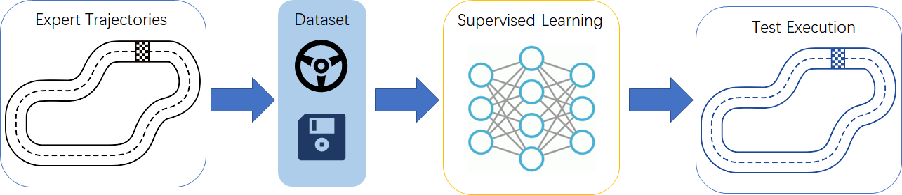

虽然模仿学习 (IL) 与 强化学习 (RL) 一样都需要与环境进行交互，并且大多遵从 Markov Decision Process (MDP)，但是在机器学习中，模仿学习属于监督式学习的范围 (Supervised learning)，所演示的动作就是模仿学习的训练集。但是与一般的监督式学习不同的是，模仿学习所习得的是一个策略 $\pi(a)$，要做的是一系列的动作，而非单独的动作。

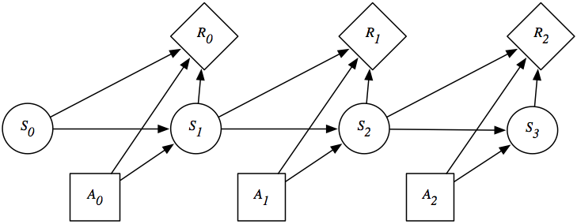

### 1.2 算法概述

由于 IL 遵循 MDP，因此沿用了 MDP 中的符号，$\mathcal{A}$ 代表动作集，$a_t$ 为 t 时刻的动作；$\mathcal{S}$ 为状态集，$s_t$ 为 t 时刻的状态； $\pi$ 为策略, $\pi^*$ 为最优策略， $\theta$ 为策略参数； $\mathcal{R}$ 为奖励集， $r$ 为一个奖励。

我们认为，演示中的动作即为最优动作：$a^*\in \mathcal{A}$，演示策略即为最优策略： $\pi ^*: \mathcal{S} \rightarrow \mathcal{S}$。但通常来说，我们无法得到完整的状态 $s_t$，只能得到状态的一个观测量子集，记作 $o_t$。因此，我们要做的就是得到一个由观测集映射到动作集的策略，我们记作：$\pi _{\theta}: \mathcal{O} \rightarrow \mathcal{A}$。对于一个时刻来说就是：$a_t = \pi _{\theta}(o_t)$。在当前状态 $s_t$，采取动作 $a_t$ 后，我们由一定的概率可以达到 $s1_{t+1}$，或$sn_{t+1}$。因此状态变换的迁移函数我们记作：$s_{t+1} = T(s_t,a_t)$。智能体到达一个新的状态后会得到相应的奖励 $r(s')$，我们用一个损失函数 $\mathcal{L}(\pi^*,\pi _{\theta})$ 来对比智能体策略所得的总奖励 $\sum r(\pi _{\theta})$ 与演示总奖励 $\sum r(\pi ^*)$之间的差距来使得智能体的策略趋近于演示策略。但是，仅靠演示策略来训练智能体往往无法得我们想要的结果，训练出来的策略与演示策略之间存在一些差异。这些差异一方面是由于算法本身的防过拟合机制导致的，另外一方面是演示者与智能体观测到的状态空间往往并不一样。一般来说，演示者都是人类，我们观测到的状态，与智能体通过其传感器观测到的状态存在着一些差异，我们所控制的控制器与智能体之间也存在一定差异。因此在同样的场景下，演示者与智能体所做的决策会存在一定的差异。

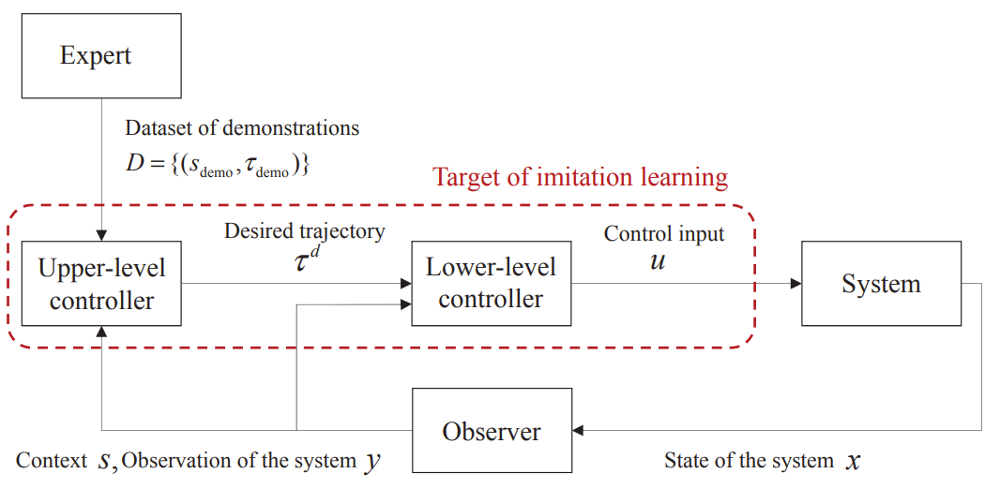

最终，模仿学习要得到的就是最优的策略参数 $\theta$。下面式子用于展示获得过程：

$$
\pi _{\theta} = argmin _{\theta} \mathbb{E}_{s \sim P(s|\pi _{\theta)}}[\mathcal{L}(\pi^*(s),\pi _{\theta}(s))]
$$

## 2. 行为克隆

### 2.1 概述与问题

最简单的模仿学习就是行为克隆 (behavioral cloning, BC)。以驾驶问题为例，行为克隆的演示者会记录下自己的轨迹，记作 $P^*(s|\pi^*)$。动作 $a^*$ 和状态 $s$ 都可以从轨迹中获得。因此我们就可以将问题简化为一个回归问题，通过监督学习的方式就可以轻松解决。使用行为克隆会使得训练的过程比较轻松，其训练的表达式为：

$$
argmin_{\theta} \mathbb{E}_{(s^*,a^*)\sim P^*}[\mathcal{(a^*,\pi_{\theta}(s^*))}]
$$

但是这个方法存在很多的问题，首先我们在使用监督式学习的时候就默认了我们的数据的采样是独立的，同分布的 (independently and identically distributed, IID)。但是这样假设在自动驾驶策略中是不成立的。通常情况下，人们在拐弯状态下，方向盘是一直处于转向状态的，即上一个状态与下一个状态之间是连续的，互相由一定影响的。但智能体的学习过程需要对转弯过程每一个时刻的角度进行独立的计算，从而导致转弯动作的拟合效果较差。

行为克隆存在的另外一个问题是训练集的数据无法展示所有可能的驾驶场景，在智能体驾驶过程中出现偏差后，车辆可能会被带入一个之前没有被展示过的场景。在这样的情况下，智能体就会不知道如何操作，最终导致严重的后果。

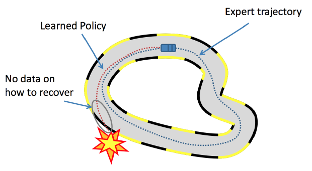

### 2.2 数据聚合 

为了解决上面的问题，我们需要使用数据聚合的方法 (Dataset Aggregation, DAgger)。算法的过程为：

> 1. 从演示者的数据集 $\mathcal{D}={o_1, a_1,...o_n,a_n}$ 中训练出一个策略 $\pi_{\theta}(a_t | o_t)$。
> 2. 运行策略 $\pi_{\theta}(a_t | o_t)$ 以获得数据集  $\mathcal{D}_{\pi}={o_1,...o_m}$。
> 3. 对数据集 $\mathcal{D}_{\pi}$ 进行标记，以获得 $\mathcal{D}_{\pi}(o_t,a_t)$。
> 4. 数据融合： $\mathcal{D} \leftarrow \mathcal{D} \cup \mathcal{D}_{\pi}$。
> 5. 重复以上 4 个步骤。

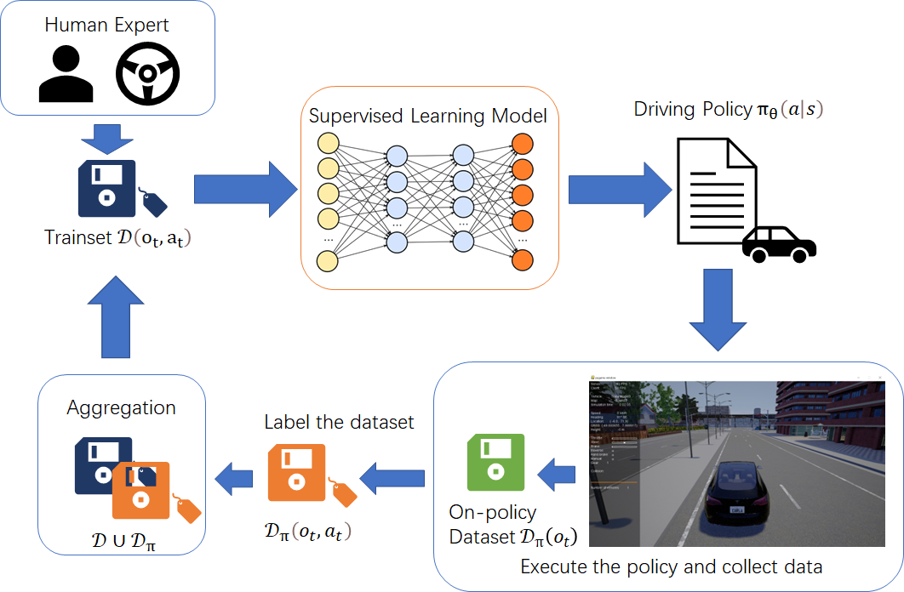

DAgger 是通过将 On-policy data 标记并作为训练数据的方法来避免在策略范围内出现没有见过的场景。但是该方法的很容易导致模型过拟合。

为了改进 DAgger，我们在系统中添加一个缓存区 (Replay Buffer)，并且对缓存区进行关键帧采样。也就是添加一个长短期记忆 (Long short-term memory ,LSTM) 到系统里。缓存区逐渐关注策略状态分布的高不确定性区域，采样数据是根据它们在驾驶行为方面为学习策略提供的效用而选择的。

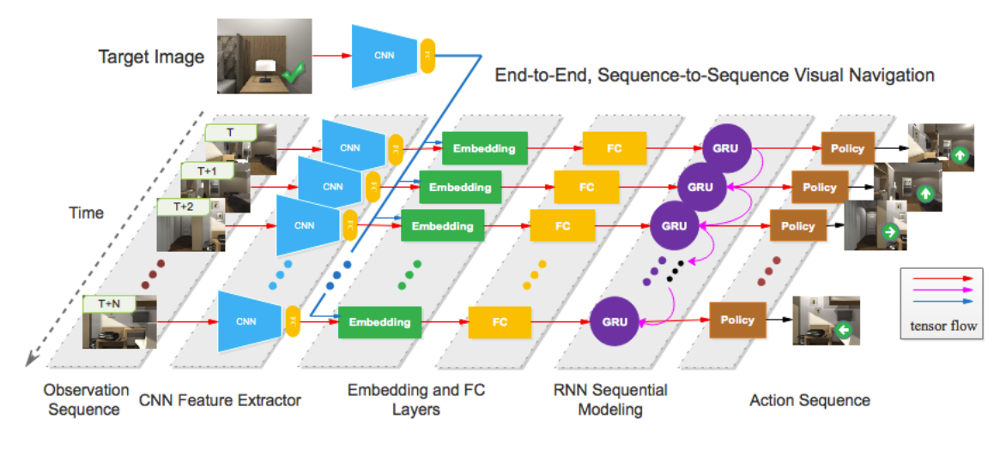

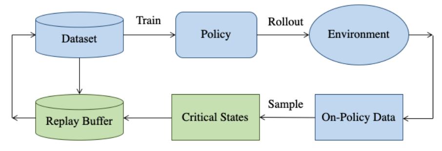

### 2.3 应用

**ALVINN**

模仿学习在自动驾驶中的应用案例多，且历史长。一个非常有名的案例在[上篇文章](https://zhuanlan.zhihu.com/p/518099071)中介绍过的 Autonomous Land Vehicle in a Neural Network (ALVINN)。该案例在 1988 年仅用三层神经网络就实现了一定程度的自动驾驶。

**PilotNet**

2016 年的时候，NVDIA 将 DAgger 应用于自动驾驶模仿学习，实现了端到端学习的自动驾驶。车辆使用三个摄像头，两两之间有三十度的夹角，这样的布局外加 CNN 便实现了在道路上的正确角度转向。

## 3. 条件模仿学习

模仿学习在自动驾驶中难以被用于城市环境的一个原因是，之前的框架并没有考虑到驾驶通常需要配合导航系统才有意义。最初的研究往往只专注于 agent 能否通过演示者的动作而习得一个驾驶策略，该策略能够在不同的驾驶环境下保证驾驶的安全。因此汽车在十字路口环境这种有多种驾驶选择的路段往往会出现问题。

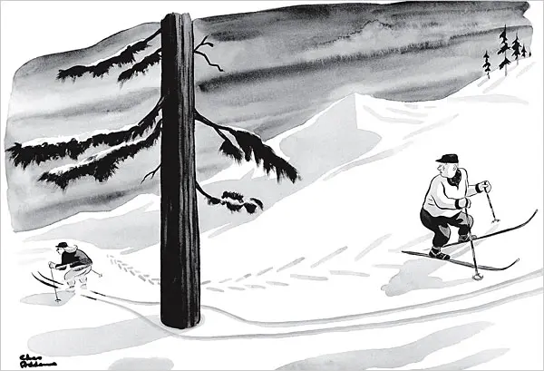

为了解决该问题，论文提出了在训练数据中添加一些高级条件指令，如：“在下一个路口左转”，这些高级指令可以是由车内的乘客提出，也可以是由车辆从 GPS导航系统获取的。通过监督学习获得在条件和传感器输入的双重信息下得出驾驶动作（方向盘，加速，刹车）。由此在遇到模棱两可的状态时，系统便会依据条件指令得出一个确定的驾驶动作。

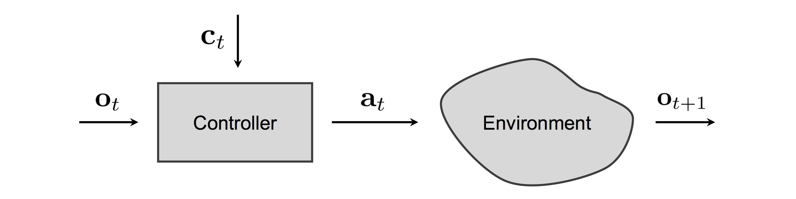

### 3.1 算法

算法是基于行为克隆的，因此大体框架与行为克隆相同。区别在于系统中被添加了一个额外的信息，条件指令 $c_i$。因此便有了以下区别：

算法的框架有两种形式，如下图所示：

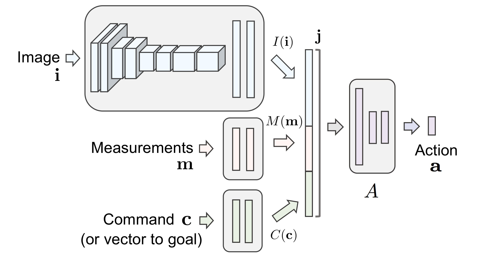

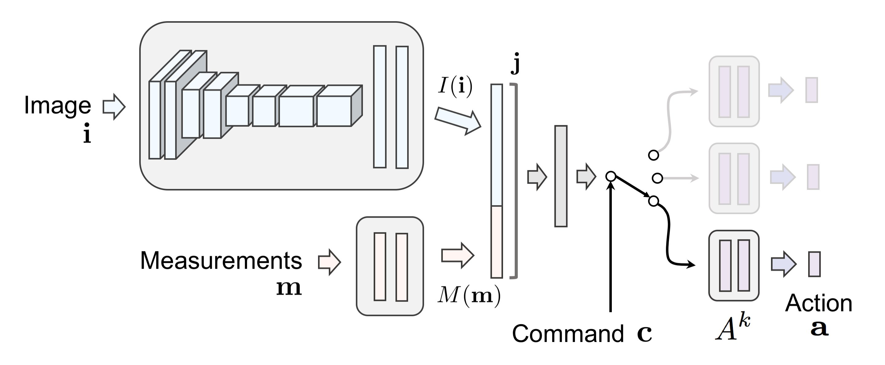

框架中的 Measurements 在文中指的是车辆的速度，而两个框架的主要区别就是在于条件指令被应用的时机。在第一个框架中，模型的输入量就是 图片信息 $i$，测量信息 $m$，以及指令 $i$ 的联合信息。而第二个框架则是先按照正常的行为模仿框架训练，但是在最后选择动作的时候添加一个新的模型，由上一个模型的输出量作为输入，外加一个指令，来得到车辆的动作。

最后，使用监督学习常用的损失函数来使得驾驶策略接近演示策略。

### 3.2 应用

在论文 [End-to-end Driving via Conditional Imitation Learning](https://arxiv.org/abs/1710.02410) 中，Codevilla 在仿真平台 Carla 和 真实环境中都做了测试，实验结果表明该算法的成功率和干预率都高于基准算法。

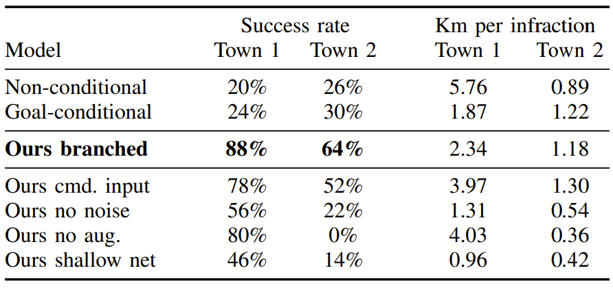

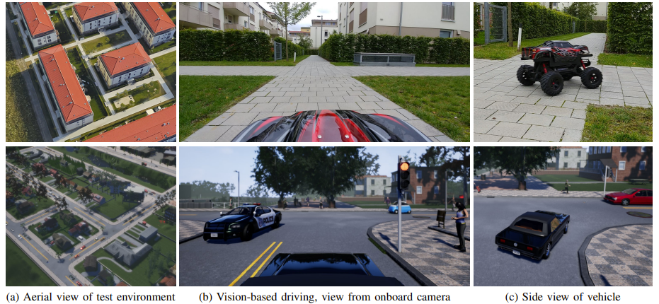

此外，本方法也被其他的论文所应用，如 [Neural Attention Fields for End-to-End Autonomous Driving](https://openaccess.thecvf.com/content/ICCV2021/html/Chitta_NEAT_Neural_Attention_Fields_for_End-to-End_Autonomous_Driving_ICCV_2021_paper.html)

> 另外还有一种更高级的模仿学习算法，逆强化学习。该算法将在以后的文章中详细的介绍。

- 上篇: [AD1. 自动驾驶的简介和历史](https://zhuanlan.zhihu.com/p/518099071)
- 下篇: [AD3. 直接感知 (Direct Perception)](https://zhuanlan.zhihu.com/p/524371862)
