#! https://zhuanlan.zhihu.com/p/524371862
# AD3. 直接感知 (Direct Perception)

## 1. 直接感知

### 1.1 简介

直接感知的概念是普林斯顿大学在 2015 年的 paper: [DeepDriving: Learning Affordance for Direct Perception in Autonomous Driving](https://openaccess.thecvf.com/content_iccv_2015/html/Chen_DeepDriving_Learning_Affordance_ICCV_2015_paper.html) 中提出的。在该论文提出之前，已经存在的框架有强化学习和模仿学习使用的端到端的框架：

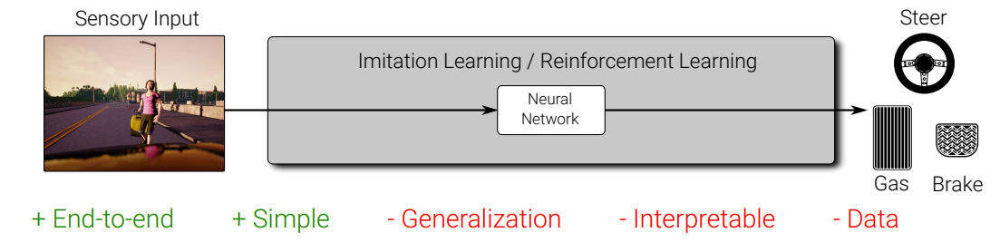

以及虽然复杂，但却是自动驾驶企业最常用的 Pipeline 式的框架：

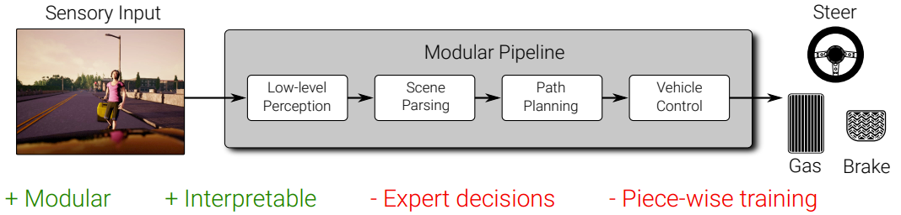

直接感知的框架相当于是两种方法的结合。相对于之前介绍 End-to-end 的模型最大的区别是先利用计算机视觉对原始数据进行处理，获取图像中对驾驶控制系统有用的指标信息，进而控制车辆。

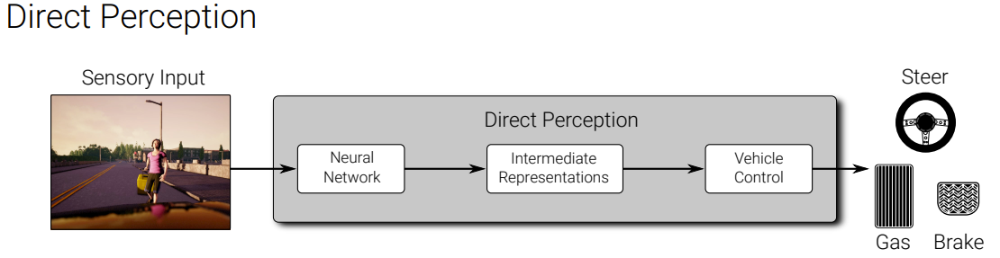

### 1.2 系统概述

在文章 DeepDriving 中，作者使用 TORCS 模拟器进行训练和实验(TORCS 模拟器的场景类似于高速公路的驾驶环境)。车辆仅有一个前置摄像头。车辆的速度则是模拟器提供的真实值。获取的图像信息交由 CNN 进行特征提取。系统的总览图如下所示：

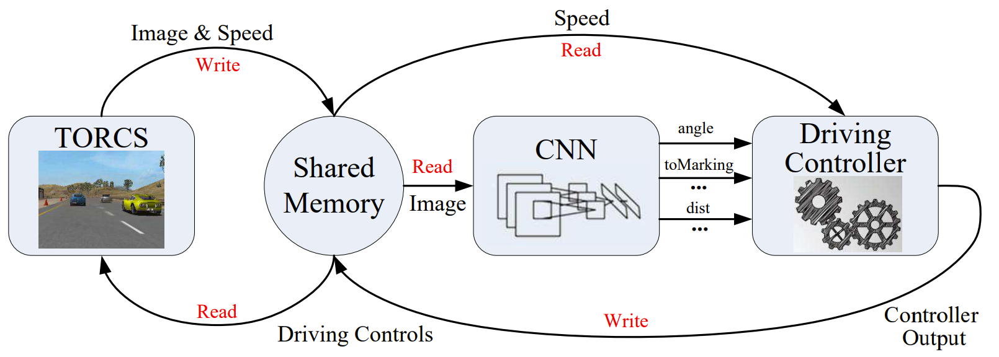

CNN 使用了标准的 AlexNet (5个卷积层和4个全连接层) 来对 13 个感知指标 (Affordances) 进行感知分类。 包括：**航向角**，**道附近车道线的距离**，**与前车之间的距离**。使用 $\mathcal{l}_2$ 作为损失函数进行训练。

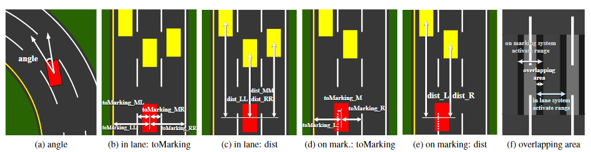

随后通过这 13 个指标对车辆的控制器进行硬性编码，得到方向盘，油门和刹车的控制。控制逻辑如下图所示：

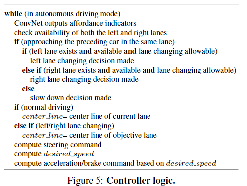

- 方向盘指令的计算式：
$$s = \theta _1(\alpha - d_c/w)$$

- 速度的计算式：
$$v - v_{max}(1- exp(\theta _2 d_p - \theta_3))$$

该文章展示了其实验的效果，从视频中可以看出，由于仅使用单相机进行感知，其车辆位置感知预测并不稳定和准确。车辆可以完成预定的变道，跟车和超车的行为。但是由于硬性编码，导致车辆的行为并不柔和。

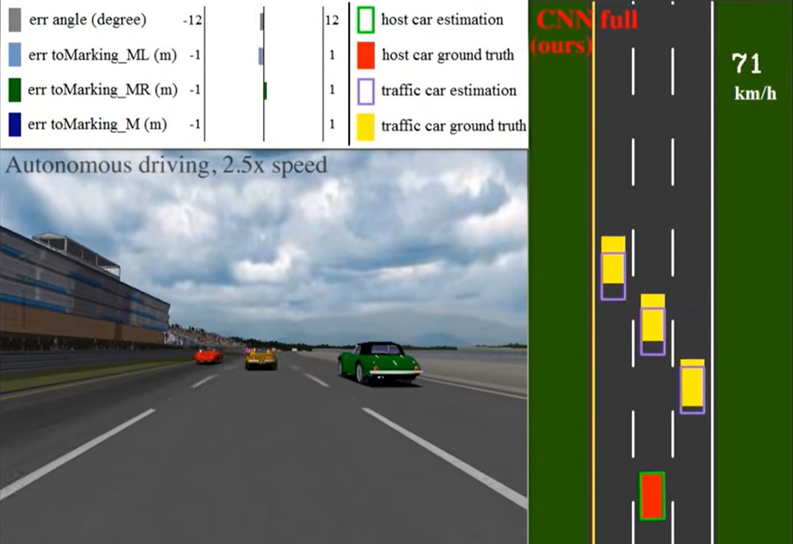

> 视频链接 [Youtube](https://www.youtube.com/watch?v=5hFvoXV9gII&ab_channel=PrincetonVision)

## 2. Conditional Affordance Learning

### 2.1 简介

Conditional Affordance Learning 是 Sauer 等人在 [Conditional Affordance Learning for Driving in Urban Environments](https://proceedings.mlr.press/v87/sauer18a.html) 中提出的方法。此方法属于直接感知框架基础论文的延申。主要目的是将 DeepDriving 的高速公路驾驶场景拓展到城市环境。除此之外，本文还借鉴了 [CIL](https://arxiv.org/abs/1710.02410) 的思想，除了 Affordances 之外还加入了驾驶条件 (由 GPS 提供的方向性导航指令)

> Sauer 对于 Affordances 的定义是由于驾驶条件和空间对于驾驶行为的限制。

总体来说，系统框架如下所示：

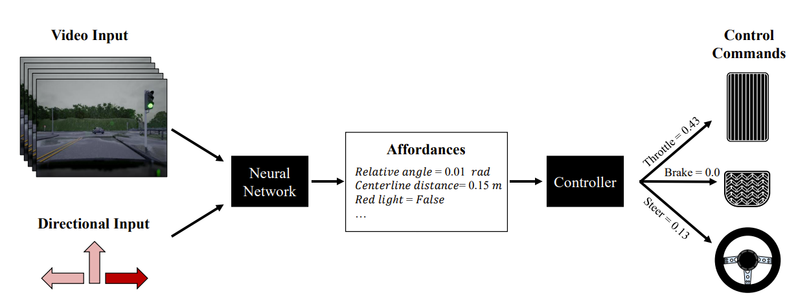

该框架即为之前提到的两个文章的系统进行了整合。即输入方面不单单使用车辆的摄像头，还使用了 GPS 提供的导航方向。将两者作为神经网络的输入，从而得到控制器所需的 Affordances (具体信息后面会讲解)。而控制器则通过 Affordances 的数值，通过硬性编码来控制油门，刹车和方向盘。在 Carla 模拟器中进行了测试与评估，并获得了高于 benchmark 的成绩。

### 2.2 算法简介

Sauer et, al 在文中所使用的系统具体来看如下图所示。在最基础的框架中，作者还为视觉系统设计了 LSTM (即储存 N 个特征地图，然后从 N 个地图中提取 Affordances) 以及 conditional/ unconditional affordances 的分区，以便更好做出控制。在控制器方面，作者设计了横向和纵向的两种控制逻辑。高级指令（GPS导航）则由 Carla 模拟器提供。

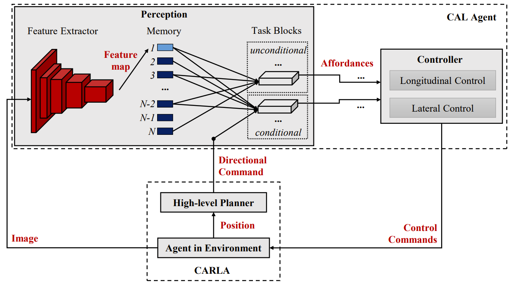
 
此外，作者还设置了 6 种应该避免的交通违章行为:

| **交通违章行为** |||
| - | - | - |
| 在错误的车道上行驶 | 超速 | 开上人行道 |
| 撞车 | 闯红灯 | 与其他东西发生碰撞 |

下面一一介绍系统种的模块：

### 2.3 感知

系统的卷积神经网络使用了 VGG16。特征提取则是一个影子网络，组成结构较为复杂，其中包括 dense layer, LSTMs, GRUs, temporal convolutional layers. 具体做法请参考问题提供的代码仓库。

感知的主要目的是为了获取 Affordances，共有 6 个 Affordances：

| **Affordances** |||
| - | - | - |
| 距中心线的距离 | 与车道的相对角度 | 与前车的距离 |
| 限速标志 | 红绿灯 | 紧急刹车 |

即如下图所示的感知任务：

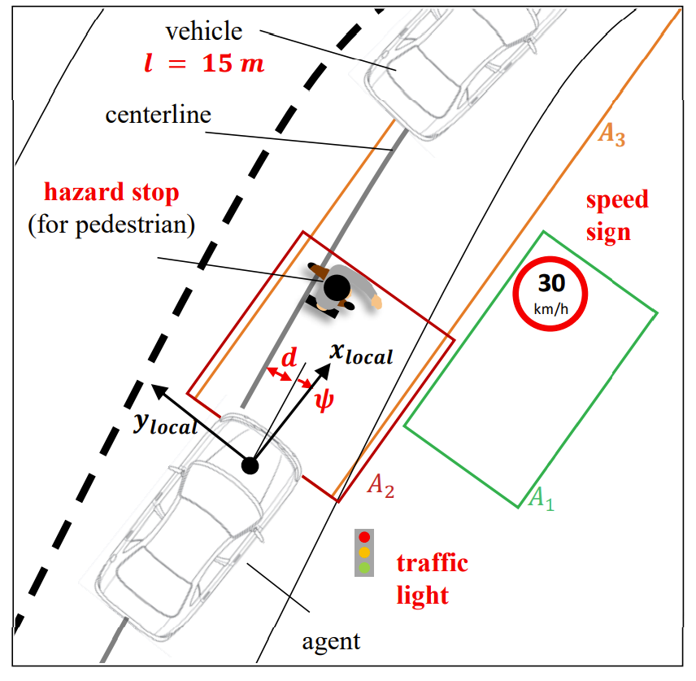

### 2.4 控制器

本系统的控制器分为横向和纵向两种。控制器是硬性编码的有限状态机。具体做法如下

**纵向控制器**

纵向控制器依据 Affordances 被分为了 5 个状态，紧急刹车，红灯，速度限制，跟车，巡航。每个状态对应不同的加速和刹车，动作则由 PID 控制器来实现。具体条件如下图所示：

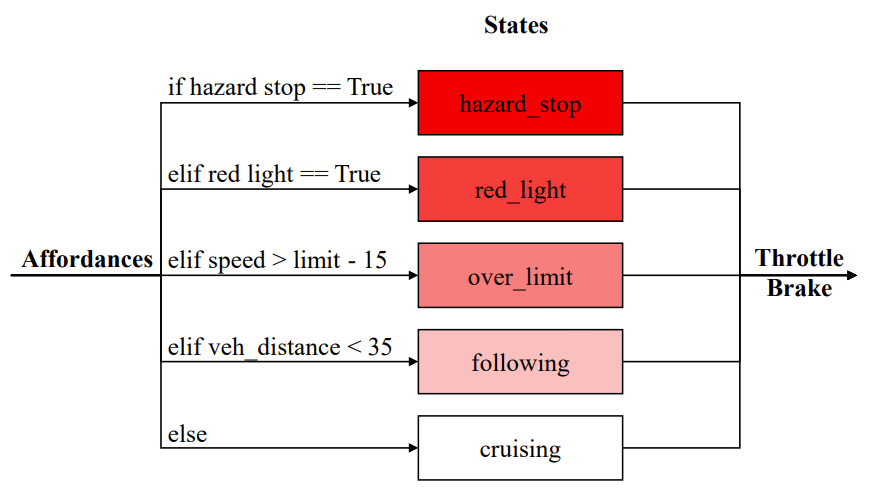

速度控制公式：

$$
e(t) = v^*(t)-v(t) = v_{max}(1 - exp(-\frac{c}{v_{max}}\mathcal{l}(t))-d)-v(t)
$$

**横向控制器**

横向则采用 Stanley Controller (DARPA 自动驾驶挑战中斯坦福车队使用的控制方法)，具体算法请查看 [论文](https://onlinelibrary.wiley.com/doi/abs/10.1002/rob.20147)

$$
\sigma_{SC}(t) = \phi(t) = arcttan(\frac{kd(t)}{v(t)})
$$

### 2.5 训练和数据

该模型的训练主要指的是感知系统的训练，即多任务学习。作者使用了 Class-weighted cross-entropy (CWCE) 来训练离散的 affordances，而 Mean average error (MAE) 则用来训连续的 affordances。优化器是 adam，batch size 为 32.

所有的训练数据均是从 Carla 模拟器中录制的，因此所有的 Affordances 都有真实值可以进行参考，省去了人工标注的时间和错误率。为了使得神经网络更加鲁棒，作者还将数据进行了高斯模糊，颜色变化，车载摄像头的位置变化等处理。

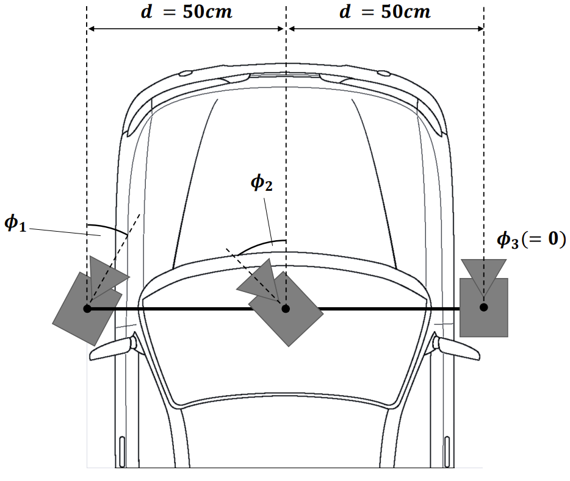

### 2.6 结果

实验与三种不同框架的基线算法进行了对比，在新环境和新天气状况下本文的方法得到了远高于其他方法的结果。

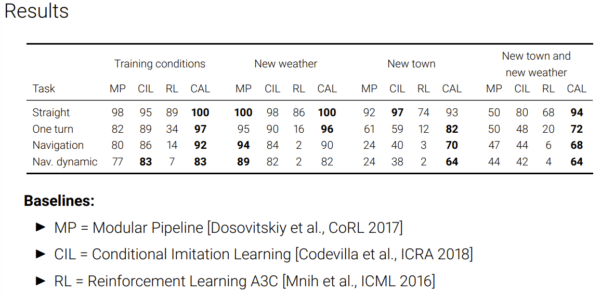

> 实验过程中的视频 [Youtube](https://www.youtube.com/watch?v=UtUbpigMgr0&t=155s&ab_channel=AndreasGeiger)

## 3. Visual Abstractions （视觉抽象）

自直接感知的自动驾驶框架 ([DeepDriving](https://zhuanlan.zhihu.com/p/469702539)) 发布以来便一直有一些质疑的声音，相对于 end-to-end 的框架来说，先感知再控制是否有必要？对此也有不少的研究试图证明直接感知框架的优越性，（如这篇在 Science Robotics 上发表的文章 [Does computer vision matter for action?](https://www.science.org/doi/full/10.1126/scirobotics.aaw6661?casa_token=4LP8xKI6EUoAAAAA:bhgegCPFU4uoB2vp9OIcYfpHYwjYkpVhQmJhVh2JWvLCIy0Pxx2FtBjPLkg-yhqxXyloMfEseOfvxg)）便说明了在驾驶和 PFS游戏中，直接感知框架相对 end-to-end 的框架来训练时长更短，平均表现更好，并且在没有见过的场景下也更加优秀。在城市自动驾驶环境中，具体什么形式的感知任务最高效。文章 [Label Efficient Visual Abstractions for Autonomous Driving](https://arxiv.org/abs/2005.10091) 便是基于以上问题展开了深入的研究。

### 3.1 简介

本文的主要研究内容，是如何在减低标注成本的前提下保证良好的驾驶行为。视觉感知的任务通常包括，目标检测，语义分割，深度和运动估计。因此要想降低标注成本，非常重要的一件事是弄清楚哪些视觉图像中的内容需要被识别，比如车辆是否需要检测天上飞的鸟？是否需要检测马路上的井盖？作者由此问题展开了研究，便得出如下的主要贡献：

- 给定相同数量的训练数据，识别的类越多效率越低，但作者发现只有少数的类别与驾驶任务直接相关。
- 在模仿学习中除了演示之外使用仅几百张带有标注的图片可以大大提高模型的表现。
- 当改变训练种子时，我们的视觉抽象会导致方差大大减少，这已被确定为模仿学习中的一个具有挑战性的问题。

实验围绕着下面的这些研究问题所开展：

- 选择特定的列别能否简化学习过程？
- 通过少量的图像训练的模型是否具有竞争力？
- 精细标注的图像是否重要？
- 视觉抽象是否能够减少训练模仿学习智能体时不同种子之间的差异？

### 3.2 方法

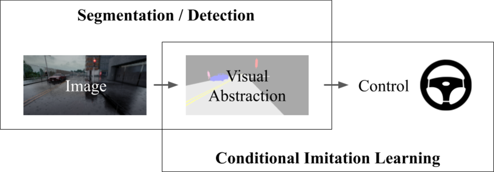

#### 3.2.1 视觉抽象

在视觉抽象时分别采用了下面三种语分割方法:

- 特权分割：即从 carla 模拟器中之间获取的语义分割真实值（像素级分割）。
- 一般分割：即使用 ResNet 和 特征金字塔网络(FPN) 的全卷积分割。
- 混合检测和分割：由语义模型（分割道路和车道线）和基于 Faster-RCNN 模型训练的箱体分割模型（标记人和车辆）。

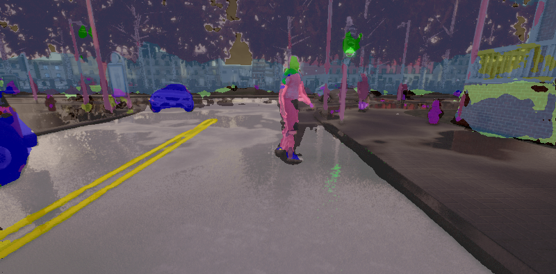

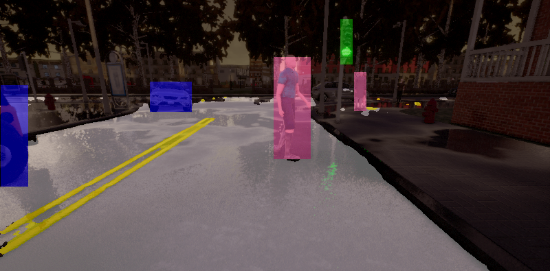

#### 3.2.2 驾驶策略

本文主要采用的模型是 CILRS [[Codevilla et al., ICCV 2019](https://openaccess.thecvf.com/content_ICCV_2019/html/Codevilla_Exploring_the_Limitations_of_Behavior_Cloning_for_Autonomous_Driving_ICCV_2019_paper.html)]，是之前所提到的 CIL 模型的更新版本，但大体框架一致。模型的输入为：视觉抽象 r, 导航指令 c，以及车辆速度 v。而输出为方向盘，油门和刹车的动作。损失函数为：$\mathcal{L} = ||a-\hat{a}||_1 + \lambda||v - \hat{v}||_1$

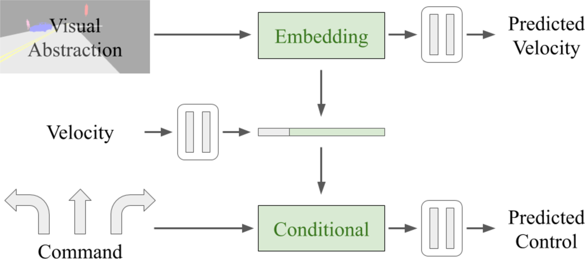

### 3.3 实验及结果

对于之前所提出的检测类别，作者分别采用了 14 个类别，7个类别，6个类别，和 5 个类别分别进行了实验。

其中，
- 14 个类别是指：路, 车道标线, 车辆, 行人, 绿灯, 红灯, 人行道, 建筑, 栅栏, 杆子, 植被, 墙壁, 交通标志, 其他。
- 7 个类别是指：路, 车道标线, 车辆, 行人, 绿灯, 红灯, 人行道, （~~建筑, 栅栏, 杆子, 植被, 墙壁, 交通标志, 其他。~~）
- 6 个类别是指：路, 车道标线, 车辆, 行人, 绿灯, 红灯, （~~人行道。~~）
- 5 个类别是指：个类别是指：路, （~~车道标线~~）, 车辆, 行人, 绿灯, 红灯。

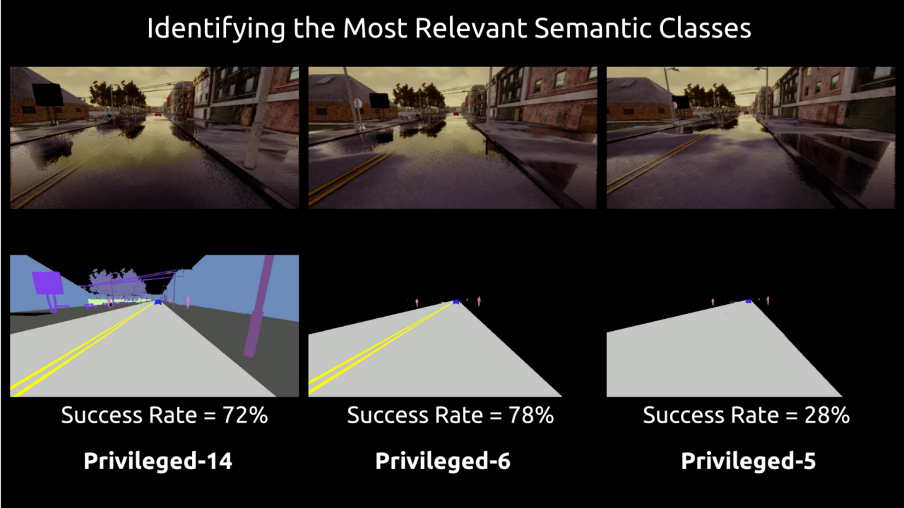

在 Carla 的 NoCrash 基准测试环境，实验结果如下图所示：

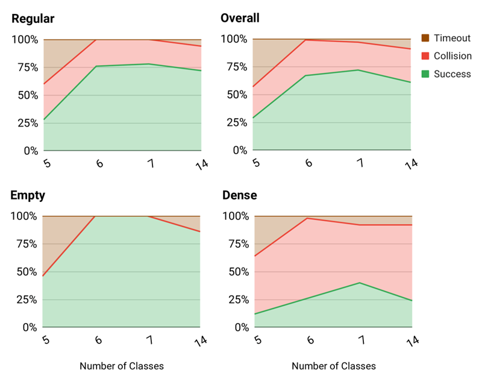

由此我们可以看出，6-7 个类别的表现并不比 14 差。但如果删除车道线，表现则会相差很多。

单独对比 6 项与 14 项，他们之间的差异也不是非常明显。

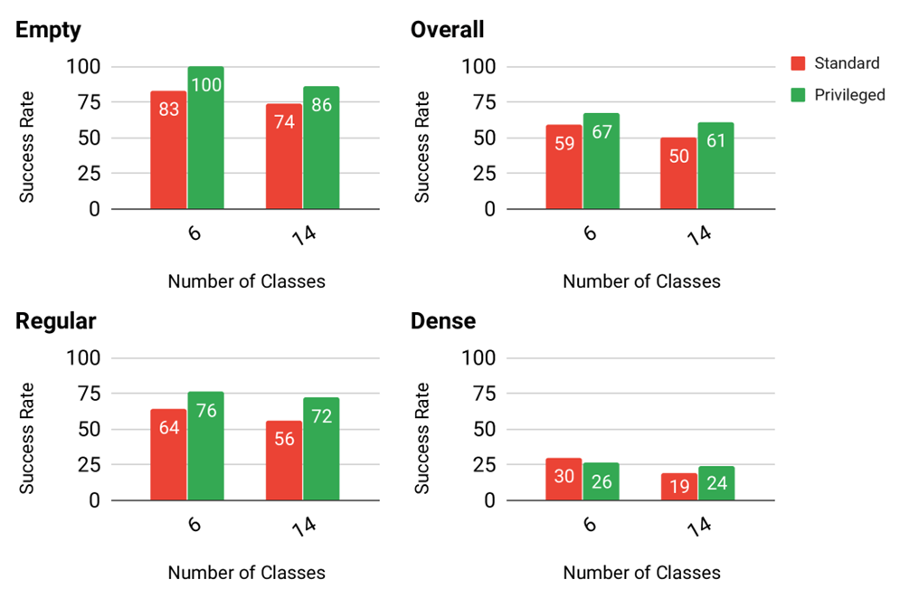

从训练量上来说，少量的类别可以优化训练成本。结合了箱体的语义分割模型，又可以进一步的优化训练成本。

|模型名称	|类别数量	|标记图像	|成本（小时）|
| - | - | - | - |
|Standard-Large-14	|14	|6400	|7500|
|Standard-Large	|6	|6400	|3200|
|Standard	|6	|1600	|800|
|Standard-Small	|6	|400	|200|
|Hybrid	|6	|1600	|50|

对比标准模型与混合模型的表现我们可以看出来，他们之间的差异并不山很大。

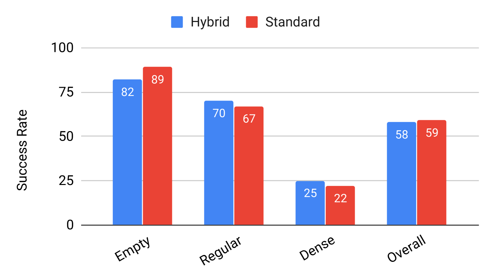

### 3.4 结论

我们发现更详细的注释并不一定能提高实际驾驶性能。实验表明，只有几百个带注释的图像，在混合模型中可以在大约 50 小时内被标记。基于分割的视觉抽象可以导致对端到端方法的显着改进。由于这种方法的模块化，它的好处可以扩展到替代策略学习技术，例如强化学习。

## 4. 驾驶策略迁移

> 此部分需参考两篇 paper [Driving Policy Transfer via Modularity and Abstraction](https://arxiv.org/abs/1804.09364) 和 [On Offline Evaluation of Vision-based Driving Models](https://arxiv.org/abs/1809.04843)

大部分的模型都是先在模拟环境中开发和测试，然后再部署在实体车辆上的。但是从模拟环境转换到实体，这之间还有一些障碍需要打破。Müller 在 Driving Policy Transfer 一文中提出了两个想法，首先是我们应该利用已经成熟的车辆控制系统，我们需要做的是将系统进行模块化封装。在部署于真实车辆上时，车辆的控制系统可以获取到低级的控制指令，而不是原数据。尤其是对于端到端的框架来说，这种思想尤为重要。

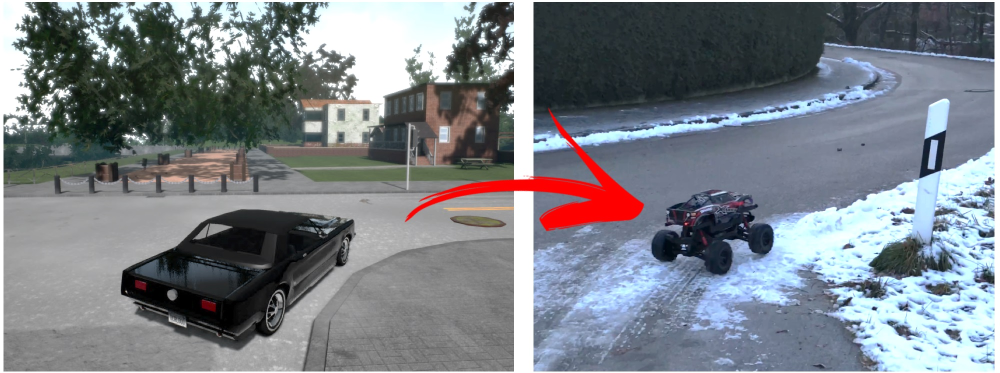

具体做法是将原来的结构分解为更细的模块，在语义分割之后，由语义地图和高级导航指令结合，生成驾驶策略，即车辆应该到达的下两个点位。由此，车辆的控制系统便可以通过 PID 控制器来操控车辆完成路线。

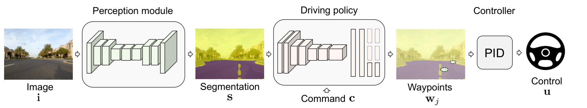

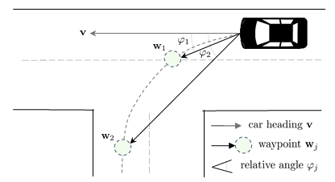

PID 控制器的公式：

$$u(t)=K_{p}e(t)+K_{i}\int_{0}^{t}e(\tau)d\tau+K_{d}\frac{de(t)}{dt},$$

此方法在现实世界的 1/5 大小的车辆上得到了验证。

- 上篇：[AD2. 模仿学习(Imitation Learning)](https://zhuanlan.zhihu.com/p/521799809)
- 下篇：[AD4. 感知模块 - 目标检测](https://zhuanlan.zhihu.com/p/544239651)