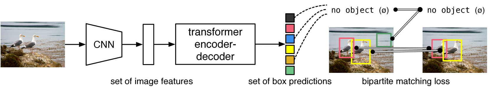

#! https://zhuanlan.zhihu.com/p/544239651
# AD4. 感知模块 - 目标检测

## 0. 前言

前面几章主要介绍了端到端自动驾驶的方法，但在工业届，最主流的解决方案依然是 Pipeline，主要可以分为两大任务，分别是场景理解和决策规划。这两大任务又可以被细分为 5 个子模块，分别是数据收集，感知和定位，场景重现，规划和决策以及控制模块。本文主要结合感知方向中目标检测的前沿论文，对该模块任务进行解析。

> 关于每一个模型的简介可以查看我的论文阅读笔记 [Paper 3. Deep Reinforcement Learning for Autonomous Driving: A Survey](https://zhuanlan.zhihu.com/p/477372894)

根据 [CVPR 2022 Workshop on Autonomous Driving](https://cvpr2022.wad.vision/) 的内容，我们可以将自动驾驶的感知任务分为以下几个内容：

- 运动预测挑战：给定代理在相应地图上过去 1 秒的轨迹，预测未来 8 秒内多达 8 个代理的位置。
- 占用和流量预测：给定代理在相应地图上过去 1 秒的轨迹，预测未来 8 秒内所有当前观察和当前被遮挡的车辆的鸟瞰图 (BEV) 占用和流量。想要了解更多关于问题定义和 Waymo 在占用率和流量预测方面的工作，可以查看论文 [Occupancy Flow Fields for Motion Forecasting in Autonomous Driving](https://arxiv.org/pdf/2203.03875.pdf)。
- 3D 语义分割：给定一个或多个激光雷达范围图像和相关的相机图像，为每个激光雷达点生成一个语义类标签。
- 仅摄像头的3D目标检测：给定来自多个摄像头的一个或多个图像，为场景中的可见对象生成一组 3D 直立框。
- 多对象跟踪 (MOT)：给定摄像机图像的视频序列，预测每个对象的 2D 边界框及其跨帧的关联。

另外，自动驾驶感知中比较热门的数据集有：

- [Waymo Open Dataset](https://waymo.com/open/)
- [NuScenes](https://www.nuscenes.org/)
- KITTI 系列的数据集，目前最新的数据集为 [KITTI 360](http://www.cvlibs.net/datasets/kitti-360/)

以上数据集都是均包含挑战赛和排行榜的，可以在 [Paper With Code](https://paperswithcode.com/task/3d-object-detection) 上查询到，另外在 Medium 的博文 [Datasets for Machine Learning in Autonomous Vehicles](https://medium.com/analytics-vidhya/datasets-for-machine-learning-in-autonomous-vehicles-dd13bae5925b) 中，作者 [Surya Gutta](https://medium.com/@suryagutta) 整理了更多的自动驾驶数据集。

## 1. 目标检测概述

目标检测是计算机视觉领域的经典话题，从人们耳熟能详的 RCNN 系列模型，YOLO 系列模型，到如今各种基于 Transformer 的模型。随着技术的发展，可以实现的目标检测任务复杂度也随着增加，大概的演变过程如下图所示：

以上都是通用目标检测，但与自动驾驶领域的目标检测任务还存在一定的区别。在自动驾驶领域，需要被检测的目标种类比较少，相比于通用视觉中常用的 1k 个分类，自动驾驶中的 NuScenes 挑战赛则只有 10 种分类：障碍物，自行车，公交车，汽车，施工车辆，摩托车，行人，卡车，拖车，交通锥。此外自动驾驶目标检测的传感器较多，以 NuScense Dataset 为例，其数据收集车辆配备了 5 个 Radar，6 个 Camera 和 1 个 Lidar。因此，自动驾驶的目标检测方法一直在探索多摄像头以及多模态之间的感知融合。

另外一点不同在于，自动驾驶的感知任务往往需要进行 3D 目标检测，这意味着除了像素级别的目标框以外，还需要对物体相对 ego vehicle 之间的深度进行预测，这是自动驾驶目标检测中的难点所在。这也使得自动驾驶的目标检测任务成为通用目标检测任务的一个重要分支。

## 2. 视觉领域的 Transformers

从 2020 年开始，基于 Transformer 模块的模型开始在视觉领域大放异彩，其中 Backbone 部分比较有名的是 ViT 模型 (详细内容请查看：[arxiv](https://arxiv.org/abs/2010.11929v2) 上的论文，[github](https://github.com/pytorch/vision/blob/main/torchvision/models/vision_transformer.py) 上 Pytorch 版的模型代码)，以及后来对 ViT 的改进模型 Swin Transformer (详细内容请查看：[arxiv](https://arxiv.org/abs/2103.14030) 上的论文，[github repo](https://github.com/microsoft/Swin-Transformer))，都达到甚至超于了传统卷积模型的上限，霸榜各类图像分类的数据集。

而 Detector 中比较有名 Transformer 模型的则是 DeTr (详细内容请查看：[arxiv](https://arxiv.org/abs/2005.12872) 上的论文，[github repo](https://github.com/facebookresearch/detr))，其改进模型 DINO，在使用 Swim-L Backbone 的时候，也成功登顶 COCO Dataset 榜单。也许未来的视觉领域也会是 Transformer 的天下。

### 2.1 Backbones

#### 2.1.1 ViT

ViT 是 Google 在 20 年提出的模型，属于视觉领域 Transformer 的早期探索，因此模型的设计与 NLP 的 sequence to sequence 理念非常相似，即如下图所示，将图像切割为 16 x 16 的 Patches 后通过位置编码，将这些图片像句子一样输入到带有多头注意力机制的 Transformer encoder 中，经过多层网络输出一系列的 Classes 的权总，最后通过一个带有 Softmax 的 MLP 模块得到该图像的分类结构。

使用 ViT 相对于 CNN 的好处在于，利用 Transformer 的 Self-Attention 机制，图像被分割的区域之间的联系被充分的利用起来了，因此可以更好的理解图像主体与内容之间的关系。而 CNN 要想做到这一点则需要使用超大卷积，影响计算效率。而 transformer 中的多头注意力机制 (Multi-head attention) 则可以充分利用 GPU 的并行计算方式，加速此过程。

> **对 Self-Attention 的理解：**
> 
> 很多非 NLP 领域的同学，包括我在看 Self-Attention 的过程中都是懵的，QKV，是什么？他们是怎么来的？这些在 [Attention is all your need](https://arxiv.org/abs/1706.03762?context=cs) 原文中都没有解释，但大概了解一下 NLP 和 RNN 之后就好理解了。类似于 RNN，Transformer 会遍历一个句子中的每一个词，其中正在遍历的词就是我们的 query (Q)，而整个句子中的每一个词 (Token) 则是 key (K)，其中在 Q 之前的我们称为 unmasked key，这些 unmasked k 会依次于 q 进行匹配（通常就是相乘），而 Q 之后的那个词，则是我们的 Value，也就是模型需要预测的值。结合下面的 RNN 和 NLP 图会更容易理解一些。而 positional encoding，就是给予每一个词一个特定的位置编码，不然在 q 与每一个 k 相乘的过程中，会失去位置信息，导致 "I love u" 与 "u love I" 没有任何区别。
> 
> 

但 ViT 的不足之处也非常的明显，那就是将一张图片非常死板的切割成了 16 x 16 的 patches，这样就会导致一个特征如果被切开了，对整个图像的分类还是挺有影响的。由此我们 Transformer 领域的下一个主角 Swin Transformer 便登场了。

#### 2.1.2 Swin Transformer

> 以下内容比较抽象且偏概念，最好结合视频讲解来理解，推荐视频： [12.1 Swin-Transformer网络结构详解 | Bilibili 霹雳吧啦Wz](https://www.bilibili.com/video/BV1pL4y1v7jC?spm_id_from=333.337.search-card.all.click&vd_source=c21b1fbe5a532229ace96b0090f25485)

相比于 ViT，微软亚研院 21 年所提出的 Swin Transformer 利用了分层滑窗的方法，解决了之前死板的图像切割问题。大概方法如下图所示：

首先，结构将不同层的图像分别进行切割成 4x4, 8x8, 16x16 大小的 patches。除此之外还将 ViT 原本的全局注意力机制改为了对每一个窗口的自注意力机制，这样的改进可以更好的利用并行计算，提高计算效率。然后再利用窗口平移，来变换每一个窗口大小以及窗口内容，从而达到不同位置之间特征的融合，解决裂开的问题。

但是这样的窗口平移对计算量来说也有很大的影响，因此作者想到了使用 mask 和 二次平移的方式来将图像整合成于 layer1 相同的计算方式，提高了运行效率。

经过这样一番操作之后，Swin Transformer 成了当今 Backbone 中绝对的 state of the art。

#### 2.1.3 Diet

ViT 除了上面的问题之外，还有一个令人头疼的问题就是其对数据量的需求实在太大了，在中等大小的数据集上训练，分类效果甚至不如 ResNet。 原文如下：

*When trained on mid-sized datasets such as ImageNet, such models yield modest accuracies of a few percentage points below ResNets of comparable size.*

因此，Facebook 团队使用了师生策略和 token 蒸馏的方法对 ViT 进行了改进，使其在小数据集上训练也可以获得非常好的效果。

> 视觉领域有关 Transformer 模型的研究非常的多，这里我先整理这些模型，对这个领域感兴趣的同学可以查看 Transformer 模型的 [Awesome list | From Yutong-Zhou-cv's Github Repo](https://github.com/Yutong-Zhou-cv/Awesome-Transformer-in-CV)，里面包含了几乎所有的 视觉 Transformer 模型。

### 2.2 Detector

#### 2.2.1 DeTr

DeTr 是 Facebook 团队 20 年 发布的模型，开创性的使用了 transformer 模块实现了目标检测任务的端到端网络。也就是说相对于 RCNN 系列 和 YOLO 来说，DeTr 省去了 region proposals, spatial anchors, window centers, non-maximal suppression 这些冗余的步骤，充分利用自注意力的特性，一步到位，令人知乎妙哉。接下来，我们看一下 DeTr 是怎么做到这一点的。

DeTr 受到 NLP 领域 sequence-2-sequece 的启发，直接输出特定数量 RoI 的预测，然后通过二分匹配损失 (bipartite matching loss)，直接与真值进行配对。由此得到了如下所示的模型架构。  

DeTr 的推理模型非常的简洁，优雅，在使用 Pytorch 框架时，不到 50 行的代码便可以实现整个流程。整个模型几乎就是将标准的 CNN backbone，例如 ResNet50，与标准的 Transformer encoder-decoder 模块进行拼接。但整个模型的难点在于训练过程，即如何设计损失函数使得预测框与真实值可以形成一一匹配。这里作者提出了以下过程的方法：

- 使 Decoder 的输出数量为一个固定值 N, N 大于图像中需要被检测的物体数量。
- 在分类集中，添加 non-object ($\phi$)，使得每一个预测框 N 都有对应的分类。
- 为了找到这两个集合之间元素无重复的一对一匹配，首先搜索一个排列 N 个元素 $\sigma\in\mathfrak{S}_{N}$ 的最低成本 （该方法类似于搜索算法中的启发值）：

$$
\hat{\sigma}=\operatorname*{arg\,min}_{\sigma\in\mathfrak{S}_{N}}\sum_{i}^{N}{%
\cal L}_{\rm match}(y_{i},\hat{y}_{\sigma(i)}),
$$

> 其中 ${\cal L}_{\rm match}(y_{i},\hat{y}_{\sigma(i)})$ 为成对匹配的损失函数，$y_i$ 为真值，$\hat{y}_{\sigma(i)}$ 为带有位置编码的预测值。 而每一个 $y$ 实际上是分类和目标框的组合，即 $y = (c,b)$，其中，$c$ 是目标分类，$b \in [0,1]^4$ 为目标框中心点以及其四个角的坐标想到对于图像尺寸的大小。因此 ${\cal L}_{\rm match}(y_{i},\hat{y}_{\sigma(i)})$ 可以写为：
> 
>${\cal L}_{\rm match}(y_{i},\hat{y}_{\sigma(i)}) = -1_{\{c_{i}\neq\varnothing\}}\hat{p}_{\sigma(i)}(c_{i})+1_{\{c_{i}\neq\varnothing\}}{\cal L}_{\rm box}(b_{i},\hat{b}_{\sigma(i)})$

- 之后再使用匈牙利匹配算法作为损失函数，缩小真值于预测之间的差距。

$$
{\cal L}_{\rm Hungarian}(y,\hat{y})=\sum_{i=1}^{N}\left[-\log\hat{p}_{\hat{%
\sigma}(i)}(c_{i})+\mathbb{1}_{\{c_{i}\neq\varnothing\}}{\cal L}_{\rm box}(b_{%
i},\hat{b}_{\hat{\sigma}}(i))\right]\,,
$$

> facebook 团队为了让更多的小白可以体验他们的模型，特意开源了 Colab 版本的快速上手推理模型。
> - [DETR's hands on Colab Notebook](https://colab.research.google.com/github/facebookresearch/detr/blob/colab/notebooks/detr_attention.ipynb) 展示如何从 hub 加载模型，并实施检测任务，然后可视化模型的注意力（类似于论文的图）。
> - [Standalone Colab Notebook](https://colab.research.google.com/github/facebookresearch/detr/blob/colab/notebooks/detr_demo.ipynb) 这个笔记本演示了如何用 50 行代码，从零开始实现 DETR 的简化版本，然后可视化预测。

### 2.3 3D Detection

> 由于我目前还没有对该领域进行系统性的研究，因此先写一些概述，以后再来填坑。

对于自动驾驶领域来说更关心 3D 目标检测，基于 DETR 前沿的研究中比较有名的有 [DETR3D](https://arxiv.org/abs/2110.06922)([Github](https://github.com/wangyueft/detr3d) 地址) 以及 [petr](https://arxiv.org/abs/2203.05625) 模型 ([Github](https://github.com/megvii-research/petr) 地址)。刚才提到的两个算法都是纯视觉的解决方案，但从 nuScenes 排行榜上来看，基于 Lidar 的方法要远好于纯视觉的方案。（SOTA 对比，Fusion mAP 0.756, Lidar mAP 0.688, Vision mAP 0.479）。从目前来看，Lidar 应该自动驾驶不可或缺的重要感知设备，但从长远角度来看，价格低廉，类似人类的纯视觉感知是可行的，非常具有研究价值的。

另外，自 21 年特斯拉 AI day 之后，自动驾驶领域对于如何生成鸟瞰图的研究逐渐火热。目前比较流行的方案有，基于视觉的，英国自动驾驶公司 Wayve 提出的 [Fiery](https://arxiv.org/abs/2104.10490)([Github](https://github.com/wayveai/fiery) 地址)，上海 AI lab 的 [BEVFormer](https://arxiv.org/abs/2203.17270) ([Github](https://github.com/zhiqi-li/BEVFormer) 地址)，以及多模态融合的 [BEVFusion-e](https://arxiv.org/abs/2205.13542)([Github](https://github.com/mit-han-lab/bevfusion) 地址)，等方案。

- 上篇：[AD3. 直接感知 (Direct Perception)](https://zhuanlan.zhihu.com/p/524371862)
- 下篇：